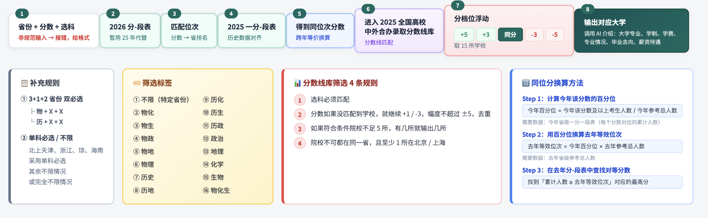
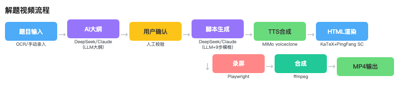

6.14本周工作总结:

一、市销一体

1、大学智能体（研究生稳上岸智能体）：
● 完成链接迁移至市场账号，大批量测试验证稳定性，修复多个bug，已上线：https://www.coze.cn/s/SvdaH8i2Ycw/
● 更新案例库逻辑：新增通用兜底案例，未提供案例的分中心也能正确显示

2、中学智能体：
● 分析总结济南试用中遇到问题的原因，并重新设计智能体架构：按学校信息直接接入即可使用的模式，解决之前通用性差的问题，在架构修改搭建的过程中，用AI批量收集城市信息录入，先跑起来再由校对
● 统招中外合办本科规划智能体同步上线：https://www.coze.cn/s/pDj0XsbYs3M/
● 中外合办智能体核心录取逻辑：省份+分数+选科→匹配位次→跨年等价换算→分数线库匹配→分档位浮动±5分取15所→输出院校+AI介绍（专业/学制/学费/毕业去向/薪资待遇）
  
● 补充规则：3+1+2省份双必选 / 单科必选or不限（京沪津浙闽琼） / 16种选科筛选标签 / 分数线库4条匹配规则（选科匹配+±5分振幅+不足5所全出+不能同省且至少1所京沪）/ 同位分换算方法

3、国际课程·一校一群（解题视频流程化）：
● 本周重点：探索和优化A-Level数学解题视频的流程化产出，已初步流程化跑通，能稳定运行，可以进行试点来优化讲题标准，之后将标准输出给信管。

  

4、新媒体/社群赋能：PTE题库更新
● 本周重点：每周题库更新拆解为多题源录取、系统整合、规定格式输出三大板块。由于各题源格式不统一，PTE题型众多，每个题型有独立的格式，所以实际是搭建了一个自动识别并清洗内容的PTE题库系统，并且还包括AI做题出答案和AI翻译的场景。

  

二、青少动画片

1、初中国际菁英英语（原小书人IP号）：
● 本周更新2期，全平台播放2,564，增粉21
● 「如何用英语介绍筷子」在小红书播放量较高，结合往期「北京中轴线」数据发现：小红书家长用户偏爱实用型内容（日常家居/出游景点等生活能用上的内容），后续选题会向这个方向倾斜
● 内容转变方案已更新，下周一与林玲老师沟通：双语全球思辨选题调整：Unlock教材+初中教材话题匹配，按校内节奏更新；配套学习资料跟随视频同步产出

2、GY动画片：
● 第一季12集（动物主题）初步制作完成
● 第二季脚本方案调整：贴近学科实际活动和教材内容，知识点输出+丰富内容，国家选择不局限主题日已有国家，结合青少教材设计
● 第二季第一期脚本已确认
● 第一季宣传预热片：脚本撰写完成，预计下周剪辑完成

三、GEO优化

1、代理商优化：
● 5平台全面监测，与W13对比：雅思机构排名1.5(↑1.73)，提及率93.3%(↓)；雅思班排名1.33(↑1.67)，提及率80%(↓)；雅思口语排名1.33(↑1.64)，提及率100%(→)
● A-Level脱产保持排名1.0+提及率100%；A-Level排名1.0但提及率降至73.3%；SAT排名1.67(↓1.33)；OSSD排名1.17(↑1.67)
● NCUK排名1.4(↓1.0)，提及率73.3%(↓100%)—需重点修复

2、自优化发稿：
● 本周共发稿11篇：自媒体6篇+官网3篇+大市场支持2篇
● 自媒体平台：国际学校择校清单/中外合办避坑/安省身份申请/NCUK路径/高考替代路径/SAT赛道
● 官网：6月SAT考情回顾/高考没考好别慌/NCUK路径
● 大市场支持：NCUK专题+OSSD专题

四、视频制作

● 高中项目-4个雅思机考口播：已拍摄未剪辑
● 青少小程序宣传片：修改完成
● 新媒体-PTE DI示范：每周一期，已拍摄四期，已交付一期

五、其他工作
支持ICC毕业典礼，负责摄像工作
